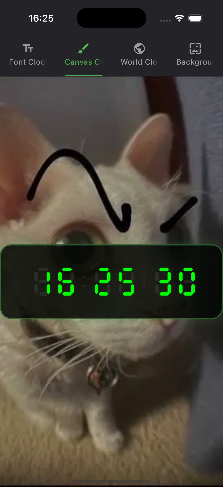
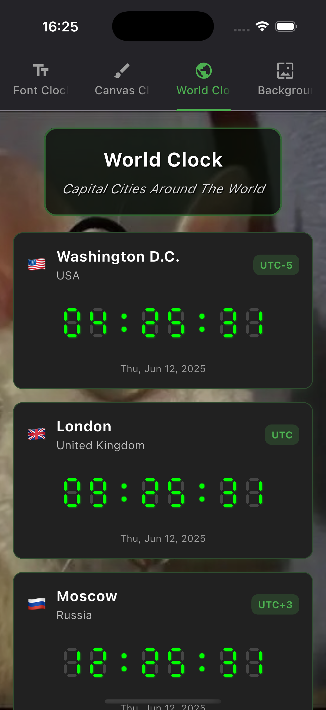
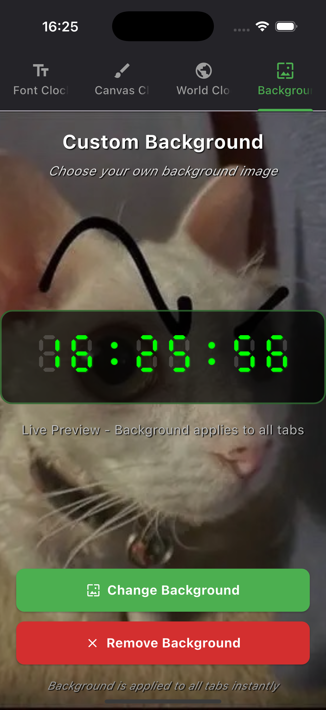

# Buid Clock App

A new Flutter project.

## Tính năng chính: 
### Tab 1: Font Clock
- Xây dựng 1 đồng hồ điện tử hiển thị thời gian hiện tại, cập nhật theo thời gian thực mỗi giây và sử dụng font E1234.
### Tab 2: Canvas Clock
- Xây dựng đồng hồ điện tử hiển thị thời gian hiện tại và cập nhật theo thời gian thực như trên nhưng thay vì sử dụng font E1234 thì sử dụng CustomPainter để có thể vẽ được đồng hồ điện từ bằng 7 đoạn và dấu ':'
### Tab 3: World Clock
- Hiển thị thời gian hiện tại của 5 thành phố trên thế giới bằng đồng hồ hiện tử phía trên.
### Tab 4: Thay đổi background
- Thay đổi background ứng dụng bằng cách chọn ảnh từ thư viện hoặc chụp ảnh.

## Demo

  

  

  

  

  

